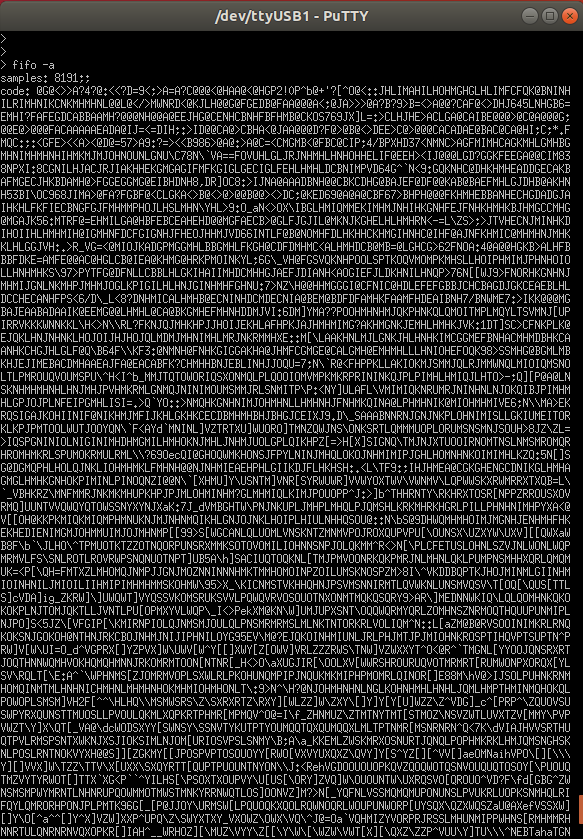
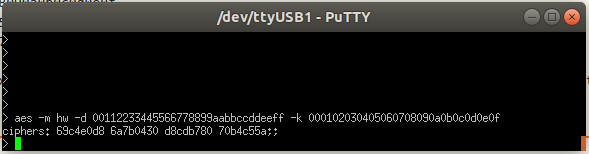
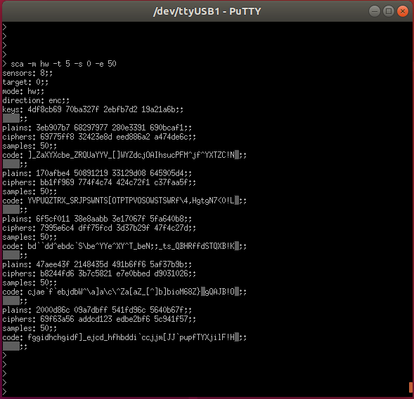

#3 - Use SCAbox
===============================================================

Goals
***************************************************************

This tutorial exposes the power leakage acquisition configurations available in the demonstration. We use the project built in `Tuto #2 <installation.html>`_ to conduct the acquistions.

This tutorial will help you in performing acquisition with a serial command:

1. Simple acquisition
2. Cropped acquisition
3. Crypto-algorithm acquisition
4. Iterated acquisition

.. note::

  - To denote the value given to an option we will always use the letter designing the option. eg. ``-s`` will be :math:`s`
  - If you want to learn more about the commands available in the demo you can displayed the help by typing ``man``

Requirements
***************************************************************

- Have completed the `Tuto #2 <installation.html>`_ 

Tutorial 
***************************************************************

The tutorial starts here !

1. Simple acquisition
---------------------------------------------------------------

A simple acquisition consists in acquiring the sensor state and storing it into the storage FIFO. The hardware repeats this operation until the FIFO is full. 

The latter is then read by the C program and the acquired values are exported through UART.

1. To perform a simple acquisition type the following command:

.. code-block:: shell

    > fifo -a

If the command executed successfully you should have an output similar to the one below in your serial terminal:

2. If you want the sensor output to be printed in number instead of char code use the option verbose ``-v`` :

.. code-block:: shell

    > fifo -a -v

.. note::
  This command prints all the FIFO content. The default SCAbox FIFO depth is **8192**.

.. note::
  With sensors running at **200 MHz**, we can monitor the leakage for a duration of **40µs**. You can increase the FIFO depth and reduce the sensor sampling frequency to increase the acquisition duration.

2. Cropped acquisition
---------------------------------------------------------------

A cropped acquisition is a simple acquisition where the data is cropped at its start and end.
The resulting data will contain :math:`e - s` samples excluding the e-th one. 

1. To perform a cropped acquisition type the following command

.. code-block:: shell

    > fifo -a -s [start] -e [end]

If the command executed successfully you should have an output similar to bellow in your terminal emulator :

.. image:: media/img/testfifocropped.png
   :width: 400
   :alt: FIFO output cropped
   :align: center

3. Crypto-algorithm acquisition
---------------------------------------------------------------

A crypto-algorithm acquisition consists in acquiring the sensor state  during a cryptographic computation and storing these values into the FIFO.
The FIFO is then read by the demo and the acquired values are sent via UART.

1. To acquire a simple run of crypto-algorithm for instance a simple AES encryption. 

.. code-block:: shell

    > aes -m [mode] -d [data] -k [key]

In this demo, the **mode** argument can be either:

- ``hw`` for VHDL hardware AES
- ``tiny`` for C tiny AES
- ``ssl`` for C OpenSSL AES
- ``dhuertas`` for C dhuertas AES

The **data** argument is the plaintext in hexadecimal.
The **key** argument is the secret key in hexadecimal.

2. For instance, type the following command:

.. code-block:: shell

    > aes -m hw -d 00112233445566778899aabbccddeeff -k 000102030405060708090a0b0c0d0e0f

3. If the command executed successfully you should have an output similar to bellow in your terminal emulator :

Note that no sensor value is displayed but the FIFO has effectively been filled. To retrieve the acquired values, you must read the FIFO :

.. code-block:: shell

    > fifo 

.. image:: media/img/testaesfifo.png
   :width: 400
   :alt: AES output
   :align: center

.. note::
    As you can see in the above picture, some Ascii caracters cannot be displayed properly using the PuTTY interface. However, they will be correctly saved in a log file.

4. **You can perform a cropped acquisition of crypto-algorithm:**

.. code-block:: shell

    > aes -m [mode] -d [data] -k [key] -e [end]

This way the hardware will stop to fill the FIFO once :math:`e` values are acquired.
You can similarly retrieve the acquired values :

.. code-block:: shell

    > fifo [-v] -s [start] -e [end]

4. Iterated acquisition
---------------------------------------------------------------

In order to perform multiple crypto-algorithms runs and capture their leakage, the demo provide a simple command that will iterate the crypto-algorithm acquisition :

.. code-block:: shell

    > sca  -m [mode] -t [iterations] -s [start] -e [end] [-v]

This command will run cryptographic computation using random data and read the FIFO at once.
This process is repeated :math:`t` times.

If the command executed correctly you should see the following output :

Conclusion
***************************************************************

In this tutorial you learned how to launch sensor's power leakage acquisition during a cryptographic encryption.
You learned how to iterate this acquisition and how to crop the power leakage.

Keep in mind that the SCA automation python tool presented in `Tuto #1 <test.html>`_ provides a powerful way to capture leakage and transmit it via UART using our protocol. It allows to capture enough traces, that can be crop to diminish acquisition time, in order to perform a successful attack.

You can customize the demo-application to change any functionally to better meet your needs. For example you can change the analyzed crypto-algorithm or the random generation of encryption data. To do this follow the `Tuto #4 <create.html>`_.

Click **Next** to start the `Tuto #4 <create.html>`_: Build your Own Designs.