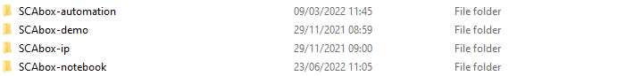

#0 - Download SCAbox
===============================================================

**Duration:** 5 min

Goals
***************************************************************

This tutorial provides the procedure to **download the SCAbox framework from GitHub**. Three SCAbox repositories will be cloned from GitHub:

1. The SCAbox_ip_ repository which contains **FPGA IP cores** built for the SCAbox project

.. _SCAbox_ip: https://github.com/emse-sas-lab/SCAbox-ip/

2. The SCAbox_automation_ repository that contains a **Python GUI application** and a library to retrieve side-channel acquisition data from serial port.

.. _SCAbox_automation: https://github.com/emse-sas-lab/SCAbox-automation/

3. The SCAbox_demo_ repository that contains a demo design and a **C application** for side-channel acquisition.

.. _SCAbox_demo: https://github.com/emse-sas-lab/SCAbox-demo

Requirements
***************************************************************

- An **internet connection**

Tutorial 
***************************************************************

1. Clone the SCAbox repositories
---------------------------------------------------------------

1. Create an **SCAbox** folder on your computer. This will be the root of the project
2. Open a **terminal** from this folder and enter the following commands. 

.. code-block:: shell

    $ git clone https://github.com/emse-sas-lab/SCAbox-ip
    $ git clone https://github.com/emse-sas-lab/SCAbox-automation
    $ git clone --recursive https://github.com/emse-sas-lab/SCAbox-demo

3. You should get the following repositories in your SCAbox folder.

Conclusion
***************************************************************

You successfully downloaded the SCAbox project. In the next tutorial we will use it to perform FPGA-based side-channel attacks. 

Click **Next** to start the `Tuto #1 <installation.html>`_: Run the Pre-Built Demo.

