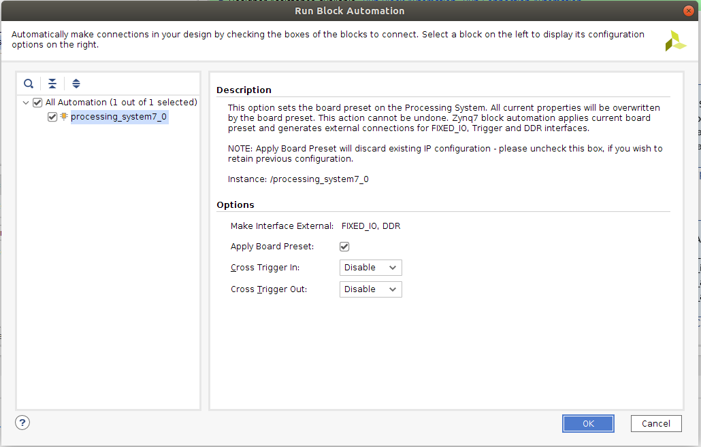
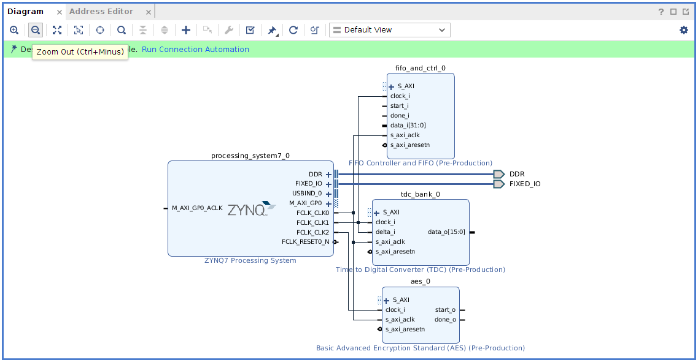
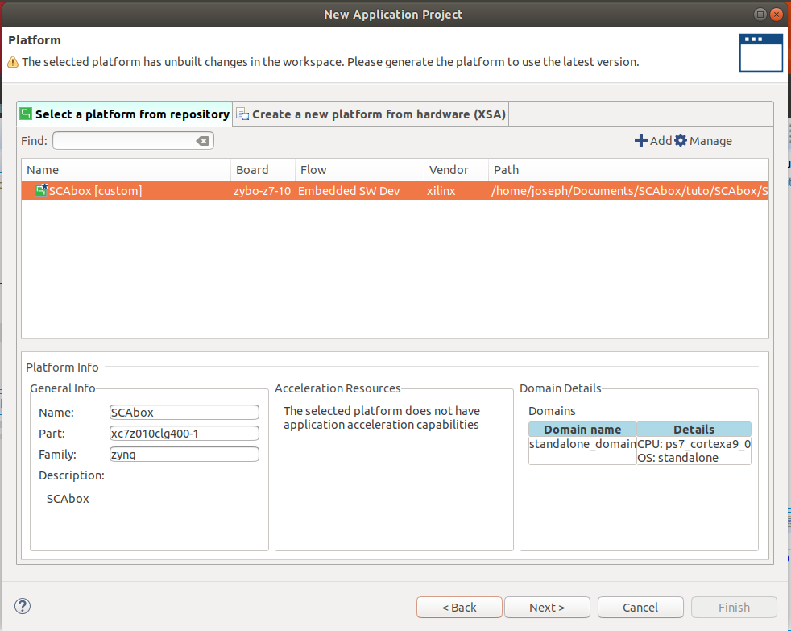

#2 - Install SCAbox
===============================================================

**Duration:** 1-2 hours (more if you need to download the Xilinx tools)

Goals
***************************************************************

The goal of this installation tutorial is to setup the SCAbox framework. 

This can be done in two steps :

1. Install the **hardware** and build the VHDL bitstream.
2. Install the **software** and build the C program.

At the end of this tutorial you will able to run your own synthetized and compiled version of the `Tuto #1 <test.html>`_.

This tutorial is mandatory if you want to customize the framework by adding sensors, crypto-cores or use another development board.

Requirements
***************************************************************

- A Xilinx Zynq-7000 SoC development board
- A micro USB cable
- Xilinx Vivado IDE
- Xilinx Vitis SDK
- Any terminal emulator such as PuTTY, TeraTerm or picocom
- `Tuto #0 <download.html>`_: Download the SCAbox Framework.

.. note::
   Here's the setup we used to create this tutorial: Linux 20.04, Digilent Zybo z7-10 board, Vivado 2020.1, Vitis 2020.1, Putty.

Emulator setup
***************************************************************

The terminal emulator allows to communicate via UART with the SoC.
It must be configured properly in order to work and allow command typing.
Bellow is given the emulator configuration used :

- port is        : /dev/ttyUSBx
- flowcontrol    : none
- baudrate is    : 921600
- parity is      : none
- databits are   : 8
- stopbits are   : 1
- local echo is  : yes

.. note::
   - If your terminal provide it, you can also use the local line edit.
   - Port name can vary according to your OS, eg. on windows its COMx 

Tutorial 
***************************************************************

The tutorial starts here !

Install the Hardware
---------------------------------------------------------------

Goals: 

- Create the SCAbox block design from an empty new vivado project.
- Generate the hardware specification file and bitstream.

1. Create a new RTL project
~~~~~~~~~~~~~~~~~~~~~~~~~~~~~~~~~~~~~~~~~~~~~~~~~~~~~~~~~~~~~~~

1. Launch Vivado
2. Click on **File > Project > New**
3. Select **project name** (e.g **"SCAbox"**) and **location** 
4. Choose **RTL project**
5. Do not add any **sources/constraints**
6. Select the **part/board** you are using (you can follow `this <https://reference.digilentinc.com/reference/software/vivado/board-files>`_ digilent tutorial if your board reference does not appear)
7. Create the project

.. image:: media/img/summary_project.png
   :width: 640
   :alt: IP repo
   :align: center

2. Add the IP repository to the project
~~~~~~~~~~~~~~~~~~~~~~~~~~~~~~~~~~~~~~~~~~~~~~~~~~~~~~~~~~~~~~~

Here we will add the IP repository to the project. The IP repo has been downloaded at the beginning of this tutorial.

1. Click on **Flow Navigator > Project Manager > IP Catalog**
2. Right click on **Vivado Repository** and select **Add Repository**
3. Select the **your_path/<SCAbox-ip/ip_repo** folder 

Once it is done the added IPs appear in the repository list:

.. image:: media/img/ip_repo.png
   :width: 640
   :alt: IP repo
   :align: center

3. Create the block design
~~~~~~~~~~~~~~~~~~~~~~~~~~~~~~~~~~~~~~~~~~~~~~~~~~~~~~~~~~~~~~~

1. Click on **Flow Navigator > IP integrator > Create Block Design**
2. Call it "**SCAbox**" and press **OK**

Now IPs can be added to the design 

3. Press the **+** button and search for **ZYNQ7 Processing System**. double click to add it.
4. Press the **+** button and search for **FIFO Controller and FIFO**. double click to add it.
5. Press the **+** button and search for **Time to Digital Converter (TDC)**. double click to add it.
6. Press the **+** button and search for **Basic Advanced Encryption Standard (AES)**. double click to add it.

You should see the following IPs in your block design:

.. image:: media/img/ip_block_design.png
   :width: 640
   :alt: IP block design
   :align: center

4. Connect the IP cores
~~~~~~~~~~~~~~~~~~~~~~~~~~~~~~~~~~~~~~~~~~~~~~~~~~~~~~~~~~~~~~~

1. Select **Run Block Automation** in the designer assistance (green message in the diagram view). Make sure **apply board preset** is checked and press ok

2. Double click on the **ZYNQ7 processing system** block and select **Clock Configuration**

3. In the PL Fabric clock arborescence check **FCLK_CLK0** and set its frequency to **50MHz** (AXI clock), check **FCLK_CLK1** and set its frequency to **200MHz** (sensor clock), check **FCLK_CLK2** and set its frequency to **10MHz** (target clock). 

4. Still in the **ZYNQ7 processing system** block, select **PS-PL Configuration**

5. Set **UART baud rate** to **921600** and press **Ok** to save the configuration

4. Connect each clock signal according to the screenshot below.

5. Double click on the **Time to Digital Converter IP** block and set **Depth** to 8 (resolution), **Count** to 8 (number of sensor), **Width** to 32 (data width for storage).

6. connect **TDC data_o[31:0]** to FIFO **data_i[31:0]**
7. connect **AES start_o** to FIFO **start_i** 
8. connect **AES done_o** to FIFO **done_i**

At this point, the design should look like this

.. image:: media/img/connected_design.png
   :width: 640
   :alt: IP block design
   :align: center

9. Select **Run Connection Automation** in the designer assistance (green message in the diagram view). Check **All Automation** and press **OK**

Vivado automatically adds interconnect and reset AXI blocks. The design is ready.

10. Save the design by pressing **ctrl+S**

.. image:: media/img/connected_axi_design.png
   :width: 640
   :alt: IP block design
   :align: center

Generate the hardware
---------------------------------------------------------------

At this point, few steps are required to have a working bitstream.

1. Generate a HDL wrapper
~~~~~~~~~~~~~~~~~~~~~~~~~~~~~~~~~~~~~~~~~~~~~~~~~~~~~~~~~~~~~~~

1. Go into the **Sources** tab

2. Right click on **SCAbox** under **Design Sources**
3. Select Create a HDL wrapper
4. Let Vivado manage the wrapper

.. image:: media/img/wrapper.png
   :width: 300
   :alt: IP block design
   :align: center

5. Click on **Flow Navigator > IP Integrator > Generate Block Design**
6. Click on **Generate** to generate the wrapper

2. Configure manual sensors placement
~~~~~~~~~~~~~~~~~~~~~~~~~~~~~~~~~~~~~~~~~~~~~~~~~~~~~~~~~~~~~~~

note
	We manually set the TDC sensor placement within the FPGA in order to obtain better side-channel results during the acquisition phase. 

1. Go into the **Design Runs** tab 

.. image:: media/img/design_run.png
   :width: 640
   :alt: IP block design
   :align: center

2. Right click on **impl_1** and select **Change Run Settings**
3. Go to the **Place Design** section in the list
4. Change the **tcl.pre** property by clicking the browse button
5. Select new script and browse for the file **your_path/SCAbox-demo/tcl/place.tcl**
6. Avoid copying sources into the project and click **Ok**

..		
	Add constraints
	~~~~~~~~~~~~~~~~~~~~~~~~~~~~~~~~~~~~~~~~~~~~~~~~~~~~~~~~~~~~~~~

	1. Go into the **Sources** tab
	2. Click on the add button 
	3. Select Add or create constraints
	4. Add the constraint file **[demo root]/xdc/zybo_cst.xdc**

	**Note** You might have to specify your own constraints if you are not using a Zybo board

3. Generate bitstream and specification
~~~~~~~~~~~~~~~~~~~~~~~~~~~~~~~~~~~~~~~~~~~~~~~~~~~~~~~~~~~~~~~

1. Click on **Flow Navigator > Program and Debug > Generate Bitstream**
2. Wait for the synthesis, implementation and bitstream writing to finish

.. image:: media/img/bitstream.png
   :width: 300
   :alt: bitstream success
   :align: center

3. Click on **File > Export > Export Hardware**
4. Select **Fixed** 
5. Select **Include bitstream** and click **Ok**

At this point Vivado must have created a .xsa file at the location you gave.
This file will later be used by Vitis to generate a platform project that will handle
all our hardware and drivers for the design we created.

.. image:: media/img/xsa.png
   :width: 600
   :alt: export hw
   :align: center

.. note::
	If you are using Xilinx SDK instead of Vitis, you do not have a .xsa file but a .hdf file (hardware definition).

Install the Software
---------------------------------------------------------------

If you completed the previous steps or if you are already provided with a BSP or a hardware specification
you are now able to bind the hardware with the demo project.

1. Create a new system project
~~~~~~~~~~~~~~~~~~~~~~~~~~~~~~~~~~~~~~~~~~~~~~~~~~~~~~~~~~~~~~~

1. Launch Vitis
2. Select your project path for the workspace

.. image:: media/img/vitis_workspace.png
   :width: 450
   :alt: export hw
   :align: center

3. Quit the **Welcome** view

.. image:: media/img/vitis_base.png
   :width: 640
   :alt: export hw
   :align: center

2. Create a new platform project
~~~~~~~~~~~~~~~~~~~~~~~~~~~~~~~~~~~~~~~~~~~~~~~~~~~~~~~~~~~~~~~

1. Click on **File > New > Platform Project**
2. Name your platform **SCAbox** and select **Next**
3. Browse for your .xsa file
4. Click on Finish to create the platform

.. image:: media/img/vitis_xsa.png
   :width: 640
   :alt: export hw
   :align: center

.. note::
   In Xilinx SDK just launch SDK from Vivado with the hardware project open and the platform project will be created.

3. Create a new application project
~~~~~~~~~~~~~~~~~~~~~~~~~~~~~~~~~~~~~~~~~~~~~~~~~~~~~~~~~~~~~~~

1. Click on **File > New > Application Project**
2. Select the previously added platform, select **Next**

3. Name the project and let default values for other parameters. Then select **Next**

4. Ensure the standalone domain is selected, then select **Next**
5. Select the **Empty Application** template, then select **Finish**

.. image:: media/img/vitis_proj_view.png
   :width: 640
   :alt: new proj xsa
   :align: center

6. Right click on the application project in the **Explorer**
7. Click on **Import Sources**
8. Add the .c and .h files from **your_path/SCAbox-demo/src**

9. Add the module folder from **your_path/SCAbox-demo/modules**

.. image:: media/img/vitis_module.png
   :width: 450
   :alt: new proj xsa
   :align: center

4. Add includes to the project
~~~~~~~~~~~~~~~~~~~~~~~~~~~~~~~~~~~~~~~~~~~~~~~~~~~~~~~~~~~~~~~

1. Right click on the application project previously created in the **Explorer**
2. Select **C/C++ Build Settings**
3. In the **Settings** tab go to **ARM v7 gcc compiler > Directories**
4. Add each directory in the **src** folder as **Include Paths**

If you correctly imported the includes you must have the following configuration :

5. Select **Apply and Close**

5. Exclude main files from build
~~~~~~~~~~~~~~~~~~~~~~~~~~~~~~~~~~~~~~~~~~~~~~~~~~~~~~~~~~~~~~~

The project modules contain main files that need to be excluded from build to avoid multiple main declaration error.

1. Right click on the **SCAboxApp/AES/main.c** source in the arborescence and select **properties**.
2. In the **properties** window check **Exclude resource from build** and select **Apply and Close**
3. Right click on the **SCAboxApp/cmd/main.c** source in the arborescence and select **properties**.
4. In the **properties** window check **Exclude resource from build** and select **Apply and Close**
5. Right click on the **SCAboxApp/tiny-AES-c/test.c** source in the arborescence and select **properties**.
6. In the **properties** window check **Exclude resource from build** and select **Apply and Close**

.. image:: media/img/excludebuild.png
   :width: 500
   :alt: Application includes
   :align: center

6. Generate a linker script
~~~~~~~~~~~~~~~~~~~~~~~~~~~~~~~~~~~~~~~~~~~~~~~~~~~~~~~~~~~~~~~

It is likely that the default linker script will set the heap and stack size to smaller values than what is needed for the demo.

1. Right click on the application project previously created on the **Explorer**
2. Select **Generate linker script**
3. Modify the **Heap Size** to 32KB
4. Modify the **Stack Size** to 32KB
5. Select **Generate** and overwrite the previous file

.. note:: 
   These values are arbitrary and might not be optimal be guarantee that the demo do not overflows.

Launch the application
---------------------------------------------------------------

1. Build the project
~~~~~~~~~~~~~~~~~~~~~~~~~~~~~~~~~~~~~~~~~~~~~~~~~~~~~~~~~~~~~~~

1. Select **Project** and press **Build All**

If no error occurs the project is ready to be downloaded into the Zynq board.

2. Launch UART communication
~~~~~~~~~~~~~~~~~~~~~~~~~~~~~~~~~~~~~~~~~~~~~~~~~~~~~~~~~~~~~~~

1. Plug your board and turn it ON
2. Ensure the mode register is set to JTAG (JP5 on Zybo)
3. Launch your terminal emulator
4. Configure a serial connection as shown above
5. Start a session with the emulator

.. image:: media/img/serial.png
   :width: 400
   :alt: Application output
   :align: center

6. Ensure local echo is on for the session.

.. image:: media/img/localecho.png
   :width: 400
   :alt: Application output
   :align: center

3. Run the application
~~~~~~~~~~~~~~~~~~~~~~~~~~~~~~~~~~~~~~~~~~~~~~~~~~~~~~~~~~~~~~~

1. Right click on the application project
2. Click on **Run As > Launch on Hardware**
3. Switch to the terminal session

.. image:: media/img/serial_welcome.png
   :width: 400
   :alt: Application output
   :align: center

5. Into the terminal type the command ``tdc``
6. Press Enter

If everything went well, you should see an output similar to the following obtained with picocom :

.. image:: media/img/tdc.png
   :width: 400
   :alt: Application output
   :align: center

The value displayed by the command is the current sensors value.
The last displayed line must be the one below, indicating that the SoC is ready to receive commands.

.. code-block:: shell

    > 

Conclusion
***************************************************************

In this tutorial you learned how to generate and build a the SCAbox framework. Through this tutorial, you built an equivalent application to the one presented in `Tuto #1 <test.html>`_. You can use it to reproduce the CPA attack presented in `Tuto #1 <test.html>`_.

The major difference with `Tuto #1 <test.html>`_ is that you now have a fully built version of the framework that you can customize to your liking. 

..
   built the framework and you can modify it. 
   block design and a bitstream associated to it. Then you used this bitstream to create a hardware specification file and integrated it into a demo application for the test-bench.
   Keep in mind that mastering this workflow will allow you to customize both the hardware and software of the test-bench.
   The block-design and the demo are only an example of what can be achieved with the framework.

In the next tutorial `Tuto #3 <acquisition.html>`_, you will learn how to use the serial commands available from the serial prompt.

You can try to customize the IPs already present by right-clicking on it and select **Customize IP**. You can also change the IPs already present with different ones. To do this follow the `Tuto #3 <acquisition.html>`_.
