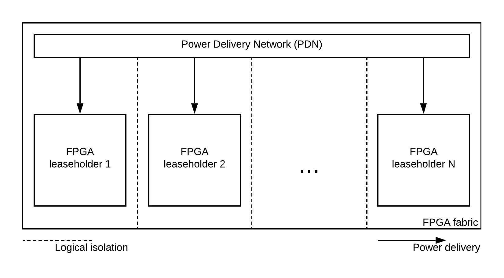

.. _wiki_overview:

Overview
===============================================================

Context
***************************************************************

FPGA devices first seen as circuit prototyping devices, are becoming increasingly popular.
This is due three main factors : the growing capabilities of these devices, 
the increase of the demand in embedded devices and hardware accelerators and lastly the end of Moore's law.

Today, in order to improve computational performances, servers can embed FPGA based *hardware accelerators*.
These are often cryptographic accelerators used for secure communication, providing a better response time to the server.
Futhermore, is now common for users of a server to *remotely* implement their own FPGA accelerator into the fabric.

.. image:: media/img/sca_servers_fpga.png
   :width: 400
   :alt: SCA Server's FPGA
   :align: center

As it is a common practice to share a server among multiple users, 
shared FPGA fabric have been recently discussed by data-centers in order to allow the rental of **multiple parts of a single FPGA fabric**.
The users will remotely implement their accelerator into their allocated space in the fabric.

Remote FPGA allows to **more users** to benefit from acceleration features and 
to the data-center to make a **more profitable** use of the fabric by increasing the used space in the fabric.

Issues
***************************************************************

Recent academic work shows that *hardware security* issues came with shared FPGA.

One of these is the logical separation, sharing a single FPGA fabric potentially allows to users to logically connect to each other.
This issue can be addressed by forbidding at implementation the logical connection between different users, this method is called *logical isolation*.

Although logical isolation is easy to performed, the fabric is still connected to the same *Power Delivery Network* (PDN).
Thus, the instantaneous power in the fabric contain information about what's happening in each user's space.

One that can have access to this *power leakage* can potentially use this data for a malicious usage.
With the emergence of FPGA based power sensors, it is even possible to **remotely capture the leakage** for malicious purposes.

Goals
***************************************************************

Regarding the above issue, we are interested in performing *remote side-channel attacks*.
While the *victim* performs encrypted communication on the server, the *attacker* remotely use power sensors.
The leakage given by the sensor will then be processed in order to perform a *Correlation Power Analysis* (CPA).
We will finally attempt to **retrieve the original encryption key** used by performing a guess from the correlation data.

Project
***************************************************************

The SCABox project aims at providing tools to learn how remote side-channel attacks works and to evaluate the different attack configuration.
The project consist on a test-bench that provide various levels of customization, from options configuration, software changes to custom IP integration.
The project is designed to stimulate the emergence of new attack and defense technology by customizing the available framework.

Related papers
***************************************************************

Side channel attacks
---------------------------------------------------------------

The following research papers describes and experiment side channels attacks:
- [link to the papers]

FPGA based sensors
---------------------------------------------------------------
The following research papers describes and experiment FPGA based sensors:
- [link to the papers]

Remote FPGA
---------------------------------------------------------------

The following research papers describes and experiment the remote FPGA and collocation possibilities
- [link to the papers]
